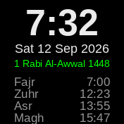

# SalaaTime

A prayer-time watch face for Bangle.js 2.

## Features
- 12 hour digital clock with Gregorian date
- Prayer times and Jamah times from Masjid Al-Yaqeen's API
- The current prayer is highlighted green, turning orange in the last 10 minutes of its window
- Hijri date (can be turned off in Settings)

## How it works
The watch face fetches today's times from
`masjidalyaqeen.co.uk/wp-json/dpt/v1/prayertime` and caches the result
in `prayertimes.json`, so times still display when offline.

- Times refresh every hour; a re-fetch is triggered on load if the cached
  data is not from today.
- If the cached data is stale (not from today) the times are greyed out and
  a small `STALE` label is shown.
- A `Fajr`-to-`Isha` window is highlighted as the current prayer, with
  `Isha` wrapping through midnight until tomorrow's `Fajr`.

## Requirements
- Bangle.js 2
- A phone connection with internet access via Gadgetbridge (or the app
  will show the last cached times)

## Creator
- _your name here_